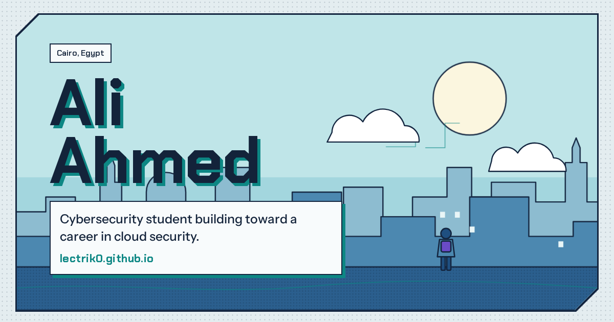
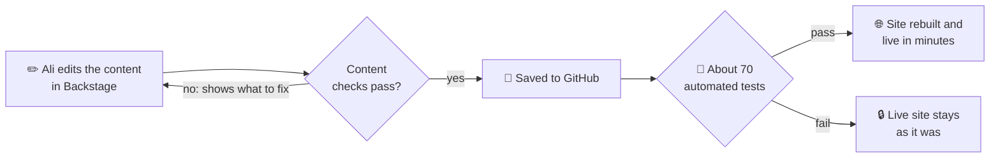

<p align="center">
  <a href="https://lectrik0.github.io"></a>
</p>

<p align="center">
  <a href="https://lectrik0.github.io"><b>Visit the site</b></a> ·
  <a href="https://lectrik0.github.io/cv.html"><b>CV</b></a> ·
  <a href="https://lectrik0.github.io/writeups/hardening-this-site.html"><b>Latest write-up</b></a>
</p>

<p align="center">
  <a href="https://github.com/Lectrik0/Lectrik0.github.io/actions/workflows/ci.yml"></a>
  
  
  
</p>

## 👋 In plain words

This is the personal website of **Ali Ahmed**, a final-year cybersecurity student in Cairo. It tells the story so far: university, an internship at a bank, and the road to cloud security, with skills, certifications, write-ups and a printable CV.

The site is also a security project in its own right. It was built from scratch, locked down the way a real company would protect its website, and every change is tested automatically before it goes live.

## 🗺️ What's on the site

| Page | What you'll find |
|---|---|
| [Home](https://lectrik0.github.io) | The story so far (open Chapter 1 for every university course), skills, certifications, write-ups, hidden flags and contact links |
| [CV](https://lectrik0.github.io/cv.html) | A one-page CV in a classic, ATS-friendly layout, ready to download as a PDF |
| [Write-ups](https://lectrik0.github.io/#writeups) | Hands-on security projects, each told as a comic-book "issue" |

## ✨ What makes it different

- ⚡ **Fast and light.** Plain web pages with no frameworks and nothing heavy to download.
- 🕶️ **Private.** No tracking, no ads, and no requests to any other website. Even the fonts come from this site.
- 🛡️ **Secure by design.** Even if harmful code slipped into the content, the browser is told never to run it. Real attack examples are thrown at the site on every change to prove it.
- ♿ **Works for everyone.** Day and night mode, readable with JavaScript turned off, and checked automatically for accessibility problems.
- 🔗 **Looks good when shared.** Links posted on LinkedIn, Slack or X show a preview card like the picture above.
- ✏️ **Easy to update.** A private, password-locked editing page called *Backstage* lets Ali change the content from a browser, with no code.

## 🔄 How an update goes live



A mistake can't break the live site: if any check fails, nothing is published and GitHub sends an email about the failed check.

## 🛡️ Security in plain words

| The risk | What stops it |
|---|---|
| Someone sneaks harmful code into the page (XSS) | All content is treated as plain text, and the browser is told to block any script that isn't part of the site. |
| A dangerous link gets added | Only safe kinds of links are allowed: secure web links, email, and pages on this site. |
| A website it depends on gets hacked | It depends on none: no outside scripts, fonts or trackers. |
| Someone tries to use the editing page | The editing key is encrypted with a password, kept only on Ali's own device, and forgotten after 30 idle minutes. |
| A broken edit goes live | About 70 automated tests run first. If any fail, the live site stays as it was. |

Found a security problem? [`security.txt`](.well-known/security.txt) says how to report it.

## 🚩 Hidden flags

Four flags are hidden around the site, capture-the-flag style. Found one? Enter it in the flag checker on the home page. The checker only stores fingerprints (SHA-256 hashes) of the answers, so reading its code won't give them away.

---

## 🧰 For developers

All content lives in one file, [`data/site.json`](data/site.json). A small build script with no dependencies renders it into plain HTML, so every page is complete without JavaScript (and readable by search engines and link previews). GitHub Pages serves the repo as-is.

```sh
npm install            # dev tools only; the build itself needs nothing but Node.js 20+
npm run build          # render data/site.json into the pages
npm start              # preview at http://127.0.0.1:4173 (behaves like GitHub Pages, incl. the 404 page)
npm run check          # fail if the pages are out of date
npm run check:content  # check data/site.json against the content rules
npm run lint           # validate the HTML
npm test               # unit tests: content schema, escaping, build output
npm run test:browser   # Playwright: errors, CSP, links, no-JS, accessibility, XSS
npm run og             # re-render assets/og.png, the link preview image
npm run pdf            # render cv.html into cv.pdf, the CV's Download PDF file
```

<details>
<summary><b>How the build works</b></summary>

```
data/site.json ──► scripts/build.mjs ──► index.html, cv.html, writeups/*.html, 404.html   (content filled in)
   (Backstage                         ├► sitemap.xml, feed.xml, robots.txt
    or by hand)                       └► .well-known/security.txt                          (Contact lines)
```

- The HTML files stay hand-written: the drawings, layout and write-ups are edited directly. The build only rewrites what comes from data:
  - regions between `<!-- build:name -->` and `<!-- /build:name -->` (nav, footer, `<head>` meta tags, skills, certifications, write-ups, course list, CV),
  - the text of elements marked `data-bind="..."` (story chapters, tagline, CV headline),
  - `?v=` version stamps on CSS/JS/image links, so a browser never mixes a new page with an old cached stylesheet.
- The output is committed. The build is deterministic: run it twice and nothing changes.
- [`assets/main.js`](assets/main.js) only adds behaviour on top: day/night toggle, flag checker, internship countdown, motion. Without it, the toggle and flag checker are hidden ([`assets/nojs.css`](assets/nojs.css)) and the course list still opens through the buttons' `command` attributes in current browsers.

</details>

<details>
<summary><b>Security controls in detail</b></summary>

| Control | How it's done here |
|---|---|
| Content Security Policy | `default-src 'none'`. Scripts, styles, fonts and images load only from this site, and `connect-src 'none'`: the public pages make no requests from script at all. No inline scripts, no `eval`, no plugins, no forms, no `<base>` tag injection. |
| Trusted Types | `require-trusted-types-for 'script'` with no policies allowed, so the browser refuses any `innerHTML`/`document.write` style HTML injection. |
| Content is text, never markup | The build writes data into pages only through one helper, `h()` in [`scripts/lib/html.mjs`](scripts/lib/html.mjs), which escapes every value, refuses event-handler and `style` attributes, and checks every URL. `main.js` never builds HTML; it only sets text and attributes. |
| URL allow-list | Every link from data goes through `safeUrl()`: only `https:`, `mailto:`, `tel:` (digits only) or same-site paths. `javascript:`, `data:` and plain `http:` links are dropped. |
| No third parties | Fonts are self-hosted (SIL OFL). Pages make zero requests to other domains, so there are no supply-chain scripts and visitors aren't tracked. |
| Referrer policy | `no-referrer`. Outbound links also use `rel="noopener noreferrer"`, which blocks reverse tabnabbing. |
| HTTPS | Served over HTTPS by GitHub Pages ("Enforce HTTPS" on); `upgrade-insecure-requests` in the CSP. |
| Stored data | The only stored values (day/night theme, flags found) are checked against allow-lists before use. |
| Disclosure | [`/.well-known/security.txt`](.well-known/security.txt) (RFC 9116) says how to report an issue. Its Contact lines come from the profile, and a test fails before it expires. |

**Tested on every change:** [`tests/fixtures/hostile-data.mjs`](tests/fixtures/hostile-data.mjs) puts XSS payloads (``, `<script>`, `<svg onload>`, attribute breakouts) into every text field and `javascript:`, `data:`, `vbscript:` and `http:` URLs into every link. The tests build the whole site from that and check that the payloads come out escaped, in the HTML and in a real browser, with no dialog, handler or inline script anywhere. Breaking the escaping on purpose makes those tests fail, and the CSP still blocks the injected scripts.

**Known limitation on GitHub Pages:** it doesn't allow custom HTTP response headers, so `frame-ancestors` / `X-Frame-Options`, `Permissions-Policy`, HSTS and `X-Content-Type-Options` can't be set there. The AWS setup below adds all of them.

</details>

<details>
<summary><b>Automated checks (CI)</b></summary>

[`.github/workflows/ci.yml`](.github/workflows/ci.yml) runs on every pull request and every push to `main`:

1. **Content:** `npm run check:content` checks `data/site.json` against [`data/site.schema.json`](data/site.schema.json) (types, dates, allowed values, safe URLs, valid email, links to pages that exist) and names any problem in plain words, e.g. `certs › #5 › name: Can't be empty.` It runs first so a content mistake is the first thing the failure says.
2. **Build:** on a PR the pages must already be rebuilt (`npm run check`); on `main` they're rebuilt from `data/site.json`.
3. **HTML validation** with html-validate.
4. **Unit tests:** escaping, URL filtering, deterministic build, meta tags, sitemap, feed, security.txt, and that Backstage's content checker agrees with Ajv on over a thousand edited versions of the content.
5. **Browser tests** in Chromium: each page loads with no console errors, CSP violations or failed requests; every internal link, asset and `#anchor` resolves; link previews and the preview image work; pages are complete with JavaScript off; theme toggle, flag checker and course list work; no serious accessibility problems (axe, WCAG 2.2 AA) in day and night mode; hostile content never runs; Backstage refuses content CI would reject (GitHub's API simulated); the CV renders to a one-page PDF, identical on every run, and an ATS-style text extraction (pdf.js) reads it in order with every word whole, also after content edits.
6. **Publish** (`main` only, after everything passes): the CV is rendered to `cv.pdf`, and if that or the rebuild changed anything, it's committed back to `main` and GitHub Pages redeploys. If a check fails, nothing is published and the live site stays as it was.

The tests check the site *against* the content rather than freezing today's content: what each page must show is worked out from `data/site.json`, and the content checks also run on copies of the site built from edited content (more entries, fewer entries, half-filled entries, write-ups stored out of order). So editing the content can't make a test fail unless the edit itself is a problem.

</details>

<details>
<summary><b>Editing content and Backstage</b></summary>

Edit [`data/site.json`](data/site.json), run `npm run build`, and commit both. Or use the private editor page, which needs no server and keeps no secrets in this repo:

- The real key is a GitHub fine-grained token that can only write to this repo's contents.
- On first use the token is encrypted in the browser (AES-GCM-256, key from the password via PBKDF2-SHA256 with 600,000 rounds, username bound as authenticated data) and stored only on that device. The username, password and token are never stored in plain text or sent anywhere except the token to GitHub's API.
- Unlocking decrypts the token into memory; locking, closing the tab or 30 idle minutes forgets it. Wrong attempts are slowed down.
- Before publishing, Backstage checks the content with the same rules CI uses ([`assets/content-check.js`](assets/content-check.js) + the schema, and asks GitHub whether linked pages exist). Problems are listed by field, with a *Show* button that jumps to it, and nothing is published until they're fixed.
- Before publishing, Backstage also lays the CV out as it prints (with the same layout code as the build, [`assets/cv-layout.js`](assets/cv-layout.js)) and refuses an edit that would push it onto a second page. The CV tab shows how full the page is as you type.
- **History** lists earlier versions: every publish is a commit, so nothing is lost. Loading one puts it in the editor; publishing makes it live again.
- If you give it the token's expiry date (at setup, or later in the editor), Backstage reminds you two weeks before the token stops working.
- Publishing commits `data/site.json` through the GitHub API. CI then checks it again, rebuilds the pages and publishes them, usually within a few minutes; Backstage links to the run. If a check still fails there, GitHub emails the failed run and the live site doesn't change.
- The CV is one column in the style of Jake's Resume, so applicant tracking systems read it in order: plain-text contact line (phone, email, LinkedIn, GitHub) and, if set, military status, standard section names, dates on the same line as each role. Planned certifications stay off it; an earned one shows its issue date if set. The CV can use a fuller name than the rest of the site (*Full name on the CV*). No letter-spacing or small caps on it, since both split words when text is extracted from the PDF.
- A certification can have a *Verify link* (e.g. its Credly badge). Once its status is *Earned*, the home page and the CV show a **Verify ↗** link to it.
- Half-filled entries never break a page: the build leaves out an entry whose name or title is empty, and write-ups are always listed newest first by date.
- The editor page has its own CSP that only allows connections to `api.github.com`, and Trusted Types like the rest of the site.

Anyone can load the editor page, but without the encrypted token on their own device and the password, it can't do anything.

A new write-up is a new HTML page in `writeups/` (copy the existing one, keeping its `build:` markers) plus an entry in the Write-ups list. The build adds it to the home page, the feed and the sitemap, and gives it link-preview tags.

</details>

<details>
<summary><b>Hosting on AWS (<code>infra/</code>)</b></summary>

[`infra/site.yaml`](infra/site.yaml) is a CloudFormation template for serving the same site from AWS:

- **S3** bucket that is fully private (public access blocked, owner-enforced, encrypted, versioned, TLS-only bucket policy).
- **CloudFront** reads it through Origin Access Control, so the bucket is never public. HTTP/2 + HTTP/3, HTTPS only, TLS 1.2+ with a custom domain.
- **Security response headers:** CSP with `frame-ancestors 'none'`, HSTS (2 years, preload), `X-Frame-Options: DENY`, `X-Content-Type-Options`, `Referrer-Policy`, `Permissions-Policy`, COOP/CORP, and the `Server` header removed.
- **Keyless deploys:** GitHub Actions gets short-lived credentials through OIDC. The role can only be assumed from this repo's `main` branch and can only write to this bucket and invalidate this distribution. No AWS keys are stored anywhere.
- **Cost guardrail:** an AWS Budget emails a warning at 80% of a small monthly limit.

[`.github/workflows/deploy-aws.yml`](.github/workflows/deploy-aws.yml) deploys on every push to `main` (actions pinned to commit SHAs). It builds and checks the pages itself, then uploads only the public files. It skips itself until the repo variables `AWS_ROLE_ARN`, `SITE_BUCKET` and `DISTRIBUTION_ID` exist.

The editor page gets its own header policy (CSP that also allows `api.github.com`, no caching, `noindex`). The template passes `cfn-lint`.

</details>

<details>
<summary><b>Every page and file</b></summary>

| Path | What |
|---|---|
| `/` | The story (Chapter 1 opens the full GIU course list), skills, certifications, write-ups, flags |
| `/cv.html` | CV, prints cleanly to one A4 page |
| `/cv.pdf` | The same CV as a PDF (made by CI with `npm run pdf`) |
| `/writeups/*.html` | Write-ups, each told as a comic "issue" (listed on the home page) |
| `/404.html` | Not-found page |
| `/feed.xml` | Atom feed of the write-ups |
| `/sitemap.xml`, `/robots.txt` | For search engines |
| `/assets/og.png` | Link preview image (1200×630) used by LinkedIn, Slack, X and others |
| `/.well-known/security.txt` | How to report a security issue |
| `/backstage/` | The private editor (not indexed by search engines) |

</details>
